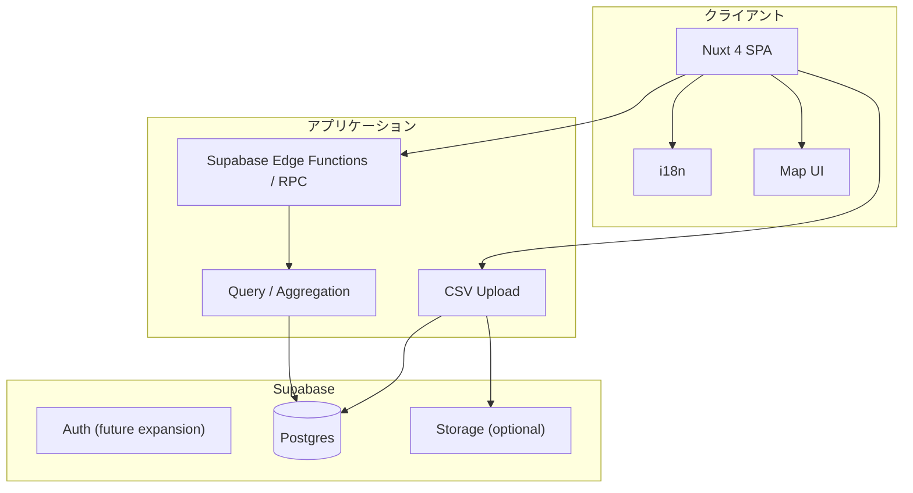

# 基本設計／詳細設計書

## 1. システム概要

### 1.1 目的

本システムは、日本人投資家向けにマレーシア不動産の相場情報を地図ベースで提供する SPA です。参考サイト `souba` の考え方を踏まえつつ、マレーシアの実取引データをもとに、エリア別価格、取引件数、物件タイプ別の傾向を可視化します。

初期リリースでは日本語のみを提供しますが、将来的な多言語展開を見据え、i18n 対応を前提とした設計とします。

初期の相場マップ対象は `Condominium/Apartment` のみとし、それ以外の物件タイプはマップ集計対象から除外します。

### 1.2 システム構成

本システムは以下の主要コンポーネントで構成されます。

1. **フロントエンド（SPA）**
   - Nuxt 4.1.3 による SPA
   - テンプレートは Pug を利用
   - UI 基盤は Tailwind CSS を採用
   - 文言管理は i18n を利用し、多言語対応可能な構成とする
   - 現時点の提供言語は日本語のみ
   - 地図、フィルタ、一覧、詳細導線を提供
   - 初期リリースは日本語のみ、将来 i18n 多言語対応を想定

2. **バックエンド**
    - Supabase を中心に構成
    - データ保存は Supabase Postgres
    - API とサーバー処理は Supabase Edge Functions / RPC を優先して構成する
    - Nuxt Server Routes は必須とせず、必要最小限または未使用とする
    - 初期フェーズでは会員登録は任意とし、全ユーザーが全機能へアクセス可能とする
    - 将来的には会員レベルによるアクセス制御を追加できる構成とする
    - 将来的なログインユーザー管理は Supabase Auth を利用し、アプリ側では `users` テーブルにロール情報を保持する

3. **データベース**
   - 取引データ、エリア、物件タイプ、開発会社、補足情報を管理
   - 詳細は [DB 設計書](./db/db-spec.md) を参照

4. **データ取り込み**
   - CSV アップロードにより取引データを取り込む
   - 既存に存在しないエリアが含まれていた場合は、新規エリアとして登録する
   - エリアの代表緯度経度は地名ベースで自動補完する
   - 自動補完できなかったものは後続で手動補正できるようにする
   - 今後 developer や補足情報を追加登録できるよう拡張性を持たせる
   - `Scheme Name/Area` は物件・プロジェクト識別子として扱い、完成年や物件ノートなどの手動補完情報を紐付ける
   - コンド名である `Scheme Name/Area` から住所候補を取得し、郵便番号エリアへ正規化する

### 1.3 システムアーキテクチャ

## 2. フロントエンド（SPA）

### 2.1 技術スタック

- **フレームワーク**: Nuxt 4
- **テンプレート**: Pug
- **スタイル**: 未確定
- **状態管理**: Nuxt 標準機能を優先し、必要に応じて composables / store を利用
- **多言語化**: i18n 前提

### 2.2 初期リリース方針

- サイト内表示は日本語のみ
- ただし文言は将来的な多言語化を見据えて管理する
- 参考サイト `souba` のように、地図ベースで相場を把握できる導線を重視する

### 2.3 主要な画面利用

- 相場トップ
- 価格 × 取引件数マップ
- 物件タイプ別比較
- CSV アップロード管理画面

詳細は [SPA 仕様書](./spa/spec.md) を参照します。

## 3. バックエンド設計

### 3.1 役割

- CSV 取り込み
- エリア、物件タイプ、developer 等の正規化
- フロントエンド用の集計 API 提供
- 将来的な補足情報登録への拡張対応

### 3.2 想定構成

- データ基盤は Supabase Postgres
- API は Supabase Edge Functions / RPC を第一候補とする
- Nuxt 側はできるだけ軽量な SPA として構成する
- 初期フェーズでは認証なし公開を基本とし、将来的な会員レベル制御に備えて認可レイヤを追加可能な構成とする

### 3.3 認証・認可方針

- 初期リリースでは会員登録は任意
- 初期リリースでは全ユーザーが全コンテンツへアクセス可能
- ただし将来的な拡張として、会員レベルごとにアクセス可能範囲を制御できるようにする
- 将来的に Supabase Auth と会員テーブルを連携し、公開機能と会員限定機能を分離できる構造を想定する

#### 想定会員レベル

- `guest`: 非ログインまたは一般閲覧ユーザー
- `member`: 通常会員
- `premium`: 上位会員
- `admin`: 管理者

### 3.4 データ取り込み方針

1. CSV をアップロードする
2. 文字コード変換と TSV パースを行う
3. エリア、物件、物件タイプ、tenure、価格、面積を正規化する
4. 未登録エリアが存在する場合は、新しいエリアとして登録する
5. 取引データを保存し、集計に利用可能な状態にする

### 3.5 位置情報補完方針

- `areas` に代表緯度経度を保持する
- 位置情報は `Scheme Name/Area` を基点に住所候補を取得し、自動補完する
- 補完対象は州レベルと郵便番号エリアレベル
- 自動補完に失敗したエリアは、後続で手動修正できるようにする
- 初期フェーズのジオコーディングサービスは `Nominatim` を採用する
- 将来的に件数や制約が増えた場合は、別サービスへ差し替え可能な構成とする

## 4. データ設計方針

### 4.1 入力データ

- ファイル: `/Users/yys/Downloads/Open Transaction Data.csv`
- 文字コード: `UTF-16LE`
- 実質フォーマット: `TSV`

### 4.2 拡張方針

初期フェーズでは取引データ中心で開始するが、将来的に以下を扱えるよう設計する。

- developer 情報
- 物件マスターへの補足情報
- エリアへの補足説明
- 再開発や周辺情報

詳細は [DB 設計書](./db/db-spec.md) を参照します。

## 5. 参考情報

- 参考サイト: `https://city-development-research.vercel.app/souba`
- 実データ: `/Users/yys/Downloads/Open Transaction Data.csv`
