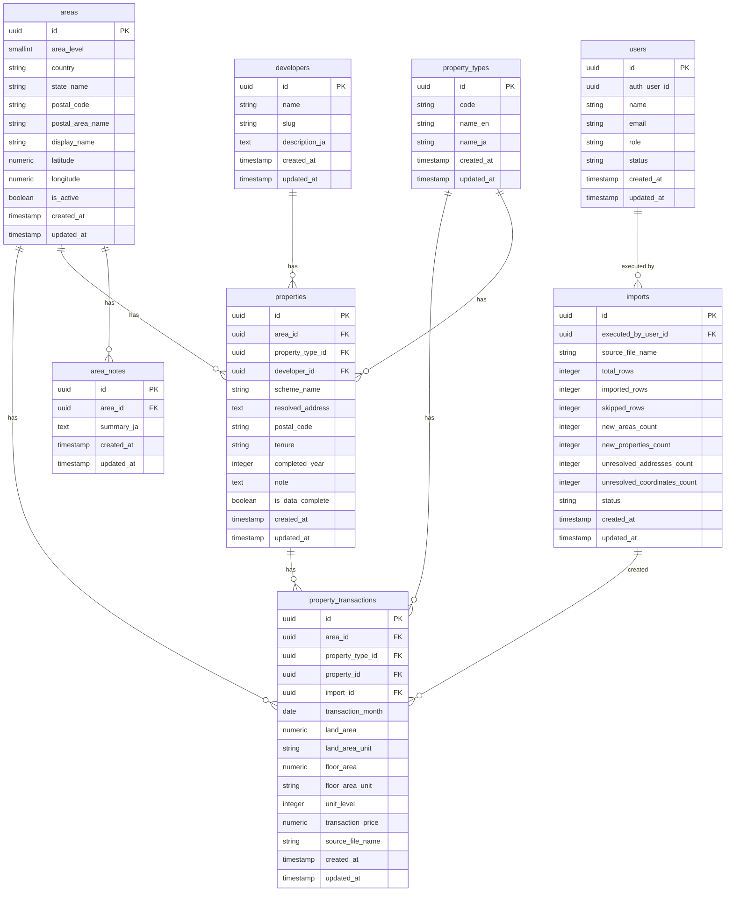

# データベース設計書

## 概要

本ドキュメントは、マレーシア不動産マップで利用するデータベースの設計書です。CSV 由来の取引データを中心に、エリア、物件タイプ、developer、将来的な補足情報を管理します。

ER 図は [ER図](./er-diagram.md) を参照してください。

## 設計方針

- **基盤**: Supabase Postgres を前提とする
- **データ投入**: CSV アップロードで取引データを投入する
- **新規エリア登録**: 取り込み時に既存にないエリアが含まれる場合は、新規エリアとして登録する
- **正規化**: 生データと正規化データを分け、集計しやすい構造を維持する
- **拡張性**: 将来的な developer 管理、物件補足情報、エリア補足情報の追加を前提にする
- **多言語化対応**: 初期は日本語のみだが、エリア説明や補足文などは将来的に多言語化可能な形を意識する
- **認可拡張性**: 初期は全公開としつつ、将来的に会員レベル別アクセス制御を追加できるようにする
- **位置情報管理**: 地図表示のため、エリア単位で代表緯度経度を保持する
- **表示粒度**: エリア表示は 2 段階を想定し、各レベルで位置情報を保持できるようにする
- **位置情報補完**: 緯度経度は地名ベースで自動補完し、失敗時は手動補正できるようにする

## データ解釈方針

- `Scheme Name/Area` はエリアではなく、物件名またはプロジェクト名として扱う
- `Scheme Name/Area` がコンド名として扱えるデータを優先利用する
- 初期の相場マップ集計対象は `Property Type = Condominium/Apartment` のみとする
- 住所解決は `Scheme Name/Area` を優先し、取得できた住所から郵便番号エリアを決定する
- `completed_year` は物件単位で管理する
- 物件ノートは物件マスターに保持する
- 同一の `Scheme Name/Area` に紐づく取引には、同じ物件属性が適用されるようにする

## 管理対象

- CSV 由来の取引データ
- エリアマスタ
- 物件タイプマスタ
- developer マスタ
- 物件補足情報
- エリア補足情報
- 将来的な会員・権限制御用マスタ
- インポート履歴

## エリア表示レベル

地図表示では以下 2 段階の粒度を想定する。

- `level_1`: 州単位
- `level_2`: 郵便番号エリア単位

各レベルは地図上で代表点を持ち、ズームや UI 条件に応じて表示対象を切り替えられるようにする。

## 将来的な会員レベル

- `guest`
- `member`
- `premium`
- `admin`

## 想定 ER 図

## 現時点で確認できている入力カラム

- `Property Type`
- `District`
- `Mukim`
- `Scheme Name/Area`
- `Road Name`
- `Transaction Date の年、月`
- `Tenure`
- `Land/Parcel Area`
- `Main Floor Area`
- `Unit Level`
- `Transaction Price`

## テーブル構成

- [**areas**](./table_areas.md): エリアマスタ
- [**property_types**](./table_property_types.md): 物件タイプマスタ
- [**developers**](./table_developers.md): developer マスタ
- [**properties**](./table_properties.md): 物件マスタ
- [**property_transactions**](./table_property_transactions.md): 取引データ
- [**imports**](./table_imports.md): インポート履歴
- [**users**](./table_users.md): ユーザーマスタ

## 取り込みフロー

1. CSV をアップロードする
2. UTF-16LE を UTF-8 に変換する
3. TSV としてパースする
4. `Property Type = Condominium/Apartment` のみを対象として取り込み対象を判定する
5. 各行から物件タイプ、物件、取引情報を抽出する
6. `Scheme Name/Area` 一致をもとに物件キーを生成する
7. `Scheme Name/Area` を基点に住所候補を取得する
8. 住所から郵便番号を抽出し、州と郵便番号エリアキーを生成する
9. エリアが未登録の場合は `areas` に新規登録する
10. 緯度経度が未設定の場合は地名ベースで自動補完する
11. 自動補完に失敗した場合は未設定のまま保持し、手動補正対象として扱う
12. 物件が未登録の場合は `properties` に新規登録する
13. 物件タイプが未登録の場合は `property_types` に新規登録する
14. 取引レコードを `property_transactions` に登録する

## ジオコーディング方針

- 初期フェーズでは `Nominatim` を採用する
- 取得対象は `areas` の代表緯度経度とする
- 利用は CSV 取り込み時に `Scheme Name/Area` から住所候補を引く補完用途を基本とする
- キャッシュ前提で利用し、同一地名への重複問い合わせを避ける
- 将来的に別 provider へ差し替え可能な実装とする

## Supabase Auth との関係

- 認証ユーザー本体は Supabase Auth で管理する
- アプリケーション固有のロールや状態は `users` テーブルで管理する
- 単にログインだけでよい場合は Auth のみでも成立するが、管理者・メンバー・プレミアムなどのアプリ権限管理には `users` テーブルを持つ方が扱いやすい

## 未確定事項

- developer と property の紐付け入力を管理画面で行うか
- 集計テーブルや materialized view を使うか
