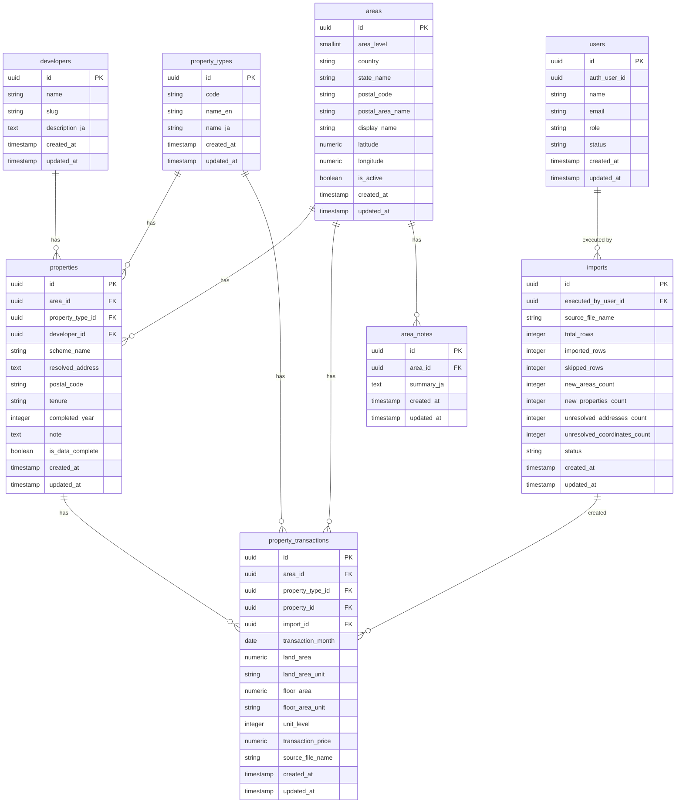

# ER図

## 概要

本ドキュメントは、マレーシア不動産マップの主要テーブル関係を示す ER 図です。

初期フェーズでは相場マップと CSV 取り込みを中心に利用し、将来的に会員レベル制御や developer 管理を拡張できる構造を前提とします。

## ER図

## 補足

- 初期の相場マップ対象は `property_types.name_en = Condominium/Apartment` のみとする
- `properties.scheme_name` は `Scheme Name/Area` を正規化した物件名・プロジェクト名として扱う
- `properties.completed_year` と `properties.note` は手動補完対象であり、同一物件に紐づく取引へ共通適用する
- `areas` は州レベルと郵便番号エリアレベルの 2 段階を扱う
- `imports` は CSV 取り込み結果の追跡に利用する
- `users` は Supabase Auth と連携するアプリ側プロフィール兼ロール管理テーブルとする
